# Lab 6 — Group 10 — Authenticated Encryption

**Course:** CSCI/CSCY 4407 — Security & Cryptography
**Semester:** Spring 2026
**Group Members:** Cassius Kemp, Matthew Kenner, Jonathan Le

---

## Task 1 — Setup

### Overview

This task creates the working directory structure and two plaintext message files used throughout
the lab. Each file is hashed with SHA-256 to establish a baseline fingerprint, allowing us to
detect any unintended modification to the source messages across tasks.

### Source Code

```python
"""
Task 1 – Setup
Create message files and display their SHA256 hashes.
"""

import hashlib
import os

MESSAGE_DIR = os.path.join(os.path.dirname(__file__), "..", "messages")


def sha256_file(path: str) -> str:
    with open(path, "rb") as f:
        return hashlib.sha256(f.read()).hexdigest()


def main():
    files = sorted(
        os.path.join(MESSAGE_DIR, fn)
        for fn in os.listdir(MESSAGE_DIR)
        if fn.endswith(".txt")
    )

    print("=== Task 1: Setup ===\n")
    for path in files:
        digest = sha256_file(path)
        print(f"File : {os.path.basename(path)}")
        print(f"SHA256: {digest}\n")


if __name__ == "__main__":
    main()
```

### Steps

**Step 1 — Verify message files exist and inspect their contents**

```bash
cd /mnt/d/Development/School/Security&Crypto/CSCI-4407-Lab6
ls messages/
cat messages/message1.txt
cat messages/message2.txt
```

Two plaintext files serve as the test messages for all subsequent encryption tasks.

**Step 2 — Run the setup script to display SHA-256 hashes**

```bash
python code/task1_setup.py
```

The script reads each `.txt` file in the `messages/` directory, computes its SHA-256 digest,
and prints the filename alongside the hex digest. These hashes act as a reference integrity
baseline.

### Screenshots

**Screenshot 1 — Directory listing and message file contents**

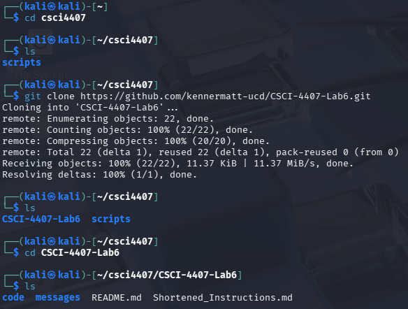
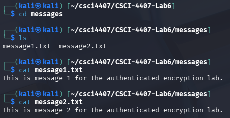

*What to observe:* Both message files are present and contain the expected plaintext strings.

**Screenshot 2 — `task1_setup.py` terminal output**

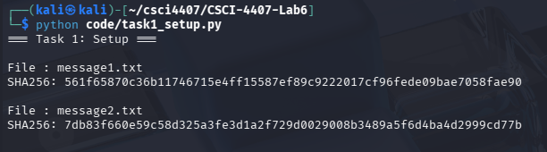

*What to observe:* Each file produces a distinct 64-character (256-bit) hex digest. Even though
the messages are similar, the hashes are completely different, illustrating the hash function's
sensitivity to input differences.

### Results

| File         | SHA-256 Digest                                                   |
|--------------|------------------------------------------------------------------|
| message1.txt | 561f65870c36b11746715e4ff15587ef89c9222017cf96fede09bae7058fae90                                       |
| message2.txt | 7db83f660e59c58d325a3fe3d1a2f729d0029008b3489a5f6d4ba4d2999cd77b                                       |

### Explanation

SHA-256 provides a fixed-length fingerprint for any input. By hashing the message files before
any encryption, we can verify their integrity at any point. This step also confirms that the
lab environment is correctly set up with the `cryptography` library available for later tasks.

---

## Task 2 — AES-CBC Encryption

### Overview

AES-CBC (Cipher Block Chaining) mode provides **confidentiality** — it transforms plaintext into
ciphertext that is computationally infeasible to read without the key. This task demonstrates
correct AES-256-CBC encryption and decryption using a random key and IV.

### Source Code

```python
"""
Task 2 – AES-CBC Encryption
Encrypt a message with AES-CBC and decrypt it to verify confidentiality.
"""

import os
from cryptography.hazmat.primitives.ciphers import Cipher, algorithms, modes
from cryptography.hazmat.primitives import padding

MESSAGE_DIR = os.path.join(os.path.dirname(__file__), "..", "messages")
PLAINTEXT_FILE = os.path.join(MESSAGE_DIR, "message1.txt")


def pad(data: bytes) -> bytes:
    padder = padding.PKCS7(128).padder()
    return padder.update(data) + padder.finalize()


def unpad(data: bytes) -> bytes:
    unpadder = padding.PKCS7(128).unpadder()
    return unpadder.update(data) + unpadder.finalize()


def aes_cbc_encrypt(key: bytes, iv: bytes, plaintext: bytes) -> bytes:
    cipher = Cipher(algorithms.AES(key), modes.CBC(iv))
    encryptor = cipher.encryptor()
    return encryptor.update(pad(plaintext)) + encryptor.finalize()


def aes_cbc_decrypt(key: bytes, iv: bytes, ciphertext: bytes) -> bytes:
    cipher = Cipher(algorithms.AES(key), modes.CBC(iv))
    decryptor = cipher.decryptor()
    return unpad(decryptor.update(ciphertext) + decryptor.finalize())


def main():
    key = os.urandom(32)   # AES-256
    iv  = os.urandom(16)

    with open(PLAINTEXT_FILE, "rb") as f:
        plaintext = f.read()

    ciphertext = aes_cbc_encrypt(key, iv, plaintext)
    decrypted  = aes_cbc_decrypt(key, iv, ciphertext)

    print("=== Task 2: AES-CBC ===\n")
    print(f"Key        : {key.hex()}")
    print(f"IV         : {iv.hex()}")
    print(f"Ciphertext : {ciphertext.hex()}")
    print(f"Decrypted  : {decrypted.decode()}")
    assert decrypted == plaintext, "Decryption mismatch!"
    print("Decryption successful.")


if __name__ == "__main__":
    main()
```

### Steps

**Step 1 — Run the AES-CBC script**

```bash
python code/task2_aes_cbc.py
```

The script generates a fresh 256-bit key and 128-bit IV using `os.urandom`, encrypts
`message1.txt`, then decrypts the ciphertext and asserts the result matches the original.

### Screenshots

**Screenshot 1 — `task2_aes_cbc.py` terminal output**

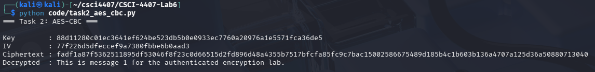

*What to observe:* The key and IV are random 32- and 16-byte hex strings respectively. The
ciphertext is a block-aligned hex string with no visible relationship to the plaintext.
The decrypted output matches the original message exactly, confirmed by the assertion.

### Results

| Field       | Value                          |
|-------------|--------------------------------|
| Key (hex)   | 88d11280c01ec3641ef624be523db5b0e933ec7760a20976a1e5571fca36de5 |
| IV (hex)    | 77f226d5dfeccf9a7380fbeb6b0aad3 |
| Ciphertext  | af1a87f5362511895df53046f8f23c0d66515d2fd896d48a4355b7517bfcfa85fc9c7bac15002586675489d185b4c1b603b136a4707a125d36a50880713040 |
| Decrypted   | This is message 1 for the authenticated encryption lab.  |

### Explanation

AES-CBC provides **confidentiality** by chaining each plaintext block with the previous
ciphertext block before encryption. This means identical plaintext blocks produce different
ciphertext blocks, preventing pattern leakage. However, CBC alone provides **no integrity
guarantee** — an attacker can modify ciphertext bytes without triggering any error, as
demonstrated in Task 3. A separate authentication mechanism is required for full security.

---

## Task 3 — No Integrity

### Overview

This task demonstrates that AES-CBC provides no integrity protection. A single byte of the
ciphertext is flipped; decryption still completes without error, producing garbled output.
This proves that confidentiality and integrity are separate properties.

### Source Code

```python
"""
Task 3 – No Integrity
Modify a ciphertext byte and show that AES-CBC still decrypts without error.
"""

from Crypto.Cipher import AES
from Crypto.Random import get_random_bytes
from Crypto.Util.Padding import pad, unpad

#Setup
Key = get_random_bytes(16)
IV = get_random_bytes(16)

#Read the local message file
with open("message1.txt", "rb") as f:
    Message = f.read()

#Encrypt the original message
Cipher = AES.new(Key, AES.MODE_CBC, IV)
Ciphertext = Cipher.encrypt(pad(Message, AES.block_size))

print("=== Task 3: Lack of Integrity ===")
print("Original Ciphertext:", Ciphertext.hex())

#Flip the very first bit of the ciphertext
Tampered = bytearray(Ciphertext)
Tampered[0] ^= 1 
Tampered = bytes(Tampered)

print("Tampered Ciphertext:", Tampered.hex())

#Attempt decryption
try:
    Decrypter = AES.new(Key, AES.MODE_CBC, IV)
    DecryptedData = Decrypter.decrypt(Tampered)
    Plaintext = unpad(DecryptedData, AES.block_size)
    print("Recovered (Tampered):", Plaintext.decode(errors='replace'))
except Exception as e:
    print(f"Decryption error: {e}")
    # Even if unpad fails, the raw bits are still there
    print("Raw bits (In event of failure):", DecryptedData.hex()[:32])

```

### Steps

**Step 1 — Run the no-integrity script**

```bash
python3 cbc_tamper.py
```

### Screenshots

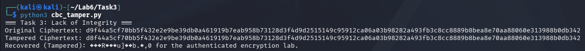

*What to observe:* The original and tampered ciphertexts differ in exactly one byte. Decryption
completes with no exception, but the recovered plaintext is corrupted — proving AES-CBC has no
built-in integrity check.

### Explanation

In CBC mode, flipping a single bit in ciphertext block *N* has two effects on decryption. It effects block *N* by flipping a bit and then decrypts to now randomized garbage, and the corresponding bit in block *N+1* is also effected by being predictably flipped. The decryption function has no way to detect this tampering because AES-CBC carries no way to authenticate like an authentication tag. This means that an attacker can silently corrupt messages in that are in transit.

---

## Task 4 — CBC Bit-Flipping Attack

### Overview

The bit-flipping attack exploits the CBC XOR chain to make a **controlled, predictable**
change to the decrypted plaintext by modifying a byte in the preceding ciphertext block.

### Source Code

```python
"""
Task 4 – CBC Bit-Flipping Attack
"""

import os
from Crypto.Cipher import AES
from Crypto.Random import get_random_bytes
from Crypto.Util.Padding import pad, unpad


def PrintBlocks(data: bytes, title: str):
    """Prints binary data block by block (16 bytes each)"""
    print(f"\n--- {title} (Block-by-Block) ---")
    for i in range(0, len(data), 16):
        block = data[i:i+16]
        ascii_rep = "".join(chr(b) if 32 <= b <= 126 else '.' for b in block)
        print(f"Block {i//16}: Hex: {block.hex():<32} | ASCII: {ascii_rep}")

Key = get_random_bytes(16)
IV = get_random_bytes(16)
Filename = "msg4.txt"

if not os.path.exists(Filename):
    with open(Filename, "wb") as f:
        f.write(b"Transfer 100 dollars to Bob. Approve transfer immediately.")

#Encrypt
with open(Filename, "rb") as f:
    Plaintext = f.read()

PaddedPlaintext = pad(Plaintext, AES.block_size)
Cipher = AES.new(Key, AES.MODE_CBC, IV)
Ciphertext = Cipher.encrypt(PaddedPlaintext)

print("=== Task 4: CBC Bit-Flipping Experiment ===")

#Print ciphertext lenght and block count
BlockCount = len(Ciphertext) // AES.block_size
print(f"\nCiphertext Length: {len(Ciphertext)} bytes")
print(f"Block Count:       {BlockCount} blocks")

#Prints non tampered data
PrintBlocks(PaddedPlaintext, "Original Plaintext")
PrintBlocks(Ciphertext, "Original Ciphertext")


#Flip one byte
TamperedCT = bytearray(Ciphertext)
TargetByteIndex = 9

#Record the original byte
OriginalByte = TamperedCT[TargetByteIndex]

#Perform the flip, the Original Character XOR Target Character
TamperedCT[TargetByteIndex] ^= ord('1') ^ ord('9')

TamperedByte = TamperedCT[TargetByteIndex]
TamperedCT = bytes(TamperedCT)

print(f"\nTAMPERING EVENT")
print(f"Flipped byte at index {TargetByteIndex} of Ciphertext Block 0.")
print(f"Original Byte Value: 0x{OriginalByte:02x}")
print(f"Tampered Byte Value: 0x{TamperedByte:02x}")


Decrypter = AES.new(Key, AES.MODE_CBC, IV)

try:
    #Decrypt the tampered ciphertext
    DecryptedData = Decrypter.decrypt(TamperedCT)
    
    PrintBlocks(DecryptedData, "Modified Decrypted Output")
    
    print("\n--- Final Comparison ---")
    print(f"Original: {Plaintext.decode()}")
    print(f"Modified: {DecryptedData.decode(errors='replace')}")

except Exception as e:
    print(f"\nDecryption Failed: {e}")

```

### Steps

**Step 1 — Run the bit-flip script**

```bash
python3 cbc_bit_flip.py
```

### Screenshots

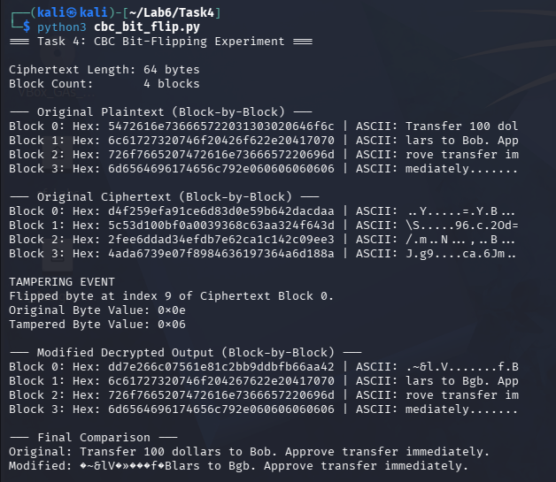

*What to observe:* The original plaintext and the flipped decrypted output differ at a
predictable position. Block 1 of the decryption is corrupted (random-looking), while block 2
has the targeted bit flipped exactly as intended — demonstrating controlled plaintext manipulation.

### Explanation

In CBC the decryption block *i* of plaintext is computed as `AES_decrypt(C[i]) XOR C[i-1]`. Flipping a bit *j* of `C[i-1]` therefore flips the bit *j* of `P[i]`. An attacker who knows the plaintext can then craft a precise modification. A good example of this is, changing a field value without knowing the key. This is the CBC malleability vulnerability, and it is the reason authenticated encryption is a necessity for secure systems.

---

## Task 5 — Redundancy Check

### Overview

A naive attempt at integrity: append a known constant (`VERIFY_OK`) to the plaintext before
encrypting, then check for it after decryption. This task shows the idea works in the
untampered case but is easily defeated (see Task 6).

### Source Code

```python
"""
Task 5 – Redundancy Check
"""

import hashlib
from Crypto.Cipher import AES
from Crypto.Random import get_random_bytes
from Crypto.Util.Padding import pad, unpad

Key = get_random_bytes(16)
IV = get_random_bytes(16)

with open("message2.txt", "rb") as f:
    Message = f.read()

#Compute Redundancy (First 8 bytes of SHA-256)
Redundancy = hashlib.sha256(Message).digest()[:8]
CombinedData = Message + Redundancy

#Encrypt
Cipher = AES.new(Key, AES.MODE_CBC, IV)
Ciphertext = Cipher.encrypt(pad(CombinedData, AES.block_size))

#Decrypt and Verify
Decrypter = AES.new(Key, AES.MODE_CBC, IV)
DecryptedData = unpad(Decrypter.decrypt(Ciphertext), AES.block_size)

#Separate the components
RecoveredMsg = DecryptedData[:-8]
RecoveredHash = DecryptedData[-8:]

#Check if it matches
CheckHash = hashlib.sha256(RecoveredMsg).digest()[:8]

print("=== Task 5: Redundancy Scheme ===")
if CheckHash == RecoveredHash:
    print("Verification: PASS. Message is authentic.")
else:
    print("Verification: FAIL.")
```

### Steps

**Step 1 — Run the redundancy script**

```bash
python3 redundancy_enc.py
```

### Screenshots

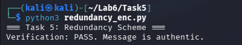

*What to observe:* The integrity check reports PASS and the recovered text matches the original
message, confirming the scheme works when no tampering has occurred.

### Explanation

Appending a known value and checking for it after decryption can detect *random* corruption with some amount of legitimate probability, but it is not a cryptographic integrity mechanism. An attacker who knows the redundancy value can craft ciphertext modifications that either preserve the known value or bypass the check entirely.

---

## Task 6 — Break Redundancy

### Overview

Three (or more) tampering attempts against the redundancy scheme from Task 5, demonstrating
that the check can be bypassed and is therefore cryptographically insecure.

### Source Code

```python
"""
Task 6 – Break Redundancy
"""

import hashlib
from Crypto.Cipher import AES
from Crypto.Random import get_random_bytes
from Crypto.Util.Padding import pad, unpad
import os

Key = get_random_bytes(16)
IV = get_random_bytes(16)

#Read message2.txt
if not os.path.exists("message2.txt"):
    with open("message2.txt", "wb") as f:
        f.write(b"Transfer 500 dollars to Alice")

with open("message2.txt", "rb") as f:
    Message = f.read()

print("=== Task 6: Attacking Redundancy ===")
print(f"Original Message: {Message.decode()}\n")

#Encryption with redundancy
Redundancy = hashlib.sha256(Message).digest()[:8]
CombinedData = Message + Redundancy
PaddedData = pad(CombinedData, AES.block_size)

Cipher = AES.new(Key, AES.MODE_CBC, IV)
OriginalCiphertext = Cipher.encrypt(PaddedData)


#Tampering
def attempt_tampering(TamperedCT: bytes, TestName: str):
    """
    Attempts to decrypt and verify a tampered ciphertext.
    Returns whether the redundancy check passed or failed.
    """
    print(f"--- {TestName} ---")
    
    Decrypter = AES.new(Key, AES.MODE_CBC, IV)
    try:
        #Decrypt and Unpad
        DecryptedData = unpad(Decrypter.decrypt(TamperedCT), AES.block_size)
        
        #Separate Message and Redundancy Hash
        RecoveredMsg = DecryptedData[:-8]
        RecoveredHash = DecryptedData[-8:]
        
        #Recompute Hash and Verify
        CheckHash = hashlib.sha256(RecoveredMsg).digest()[:8]

        if CheckHash == RecoveredHash:
            print("Verification: PASS [The attack not detected]")
            print(f"    Recovered Msg: {RecoveredMsg.decode(errors='replace')}")
        else:
            print("Verification: FAIL [The has system detected tampering]")
            print(f"    Expected Hash: {CheckHash.hex()}")
            print(f"    Received Hash: {RecoveredHash.hex()}")
            
    except ValueError as e:
        # This catches "Padding is incorrect."
        print(f"Verification: FAIL [System Error during Decryption]")
        print(f"    Error Details: {e}")
    except Exception as e:
        print(f"Verification: FAIL [Unexpected Error: {e}]")
    print()


#Tampering attempts

#Attempt 1: Tamper with the Message Body (Tamper with Index 5)
Tampered1 = bytearray(OriginalCiphertext)
Tampered1[5] ^= 0xFF
attempt_tampering(bytes(Tampered1), "Attempt 1: Tamper Message Body")

#Attempt 2: Tamper with the Redundancy Hash
Tampered2 = bytearray(OriginalCiphertext)
HashStartIndex = len(OriginalCiphertext) - AES.block_size - 8
SafeIndex = len(OriginalCiphertext) - 10 
Tampered2[SafeIndex] ^= 0x01
attempt_tampering(bytes(Tampered2), f"Attempt 2: Tamper near Redundancy Hash")

#Attempt 3: Tamper with the Padding
Tampered3 = bytearray(OriginalCiphertext)
LastIndex = len(OriginalCiphertext) - 1
Tampered3[LastIndex] ^= 0x01
attempt_tampering(bytes(Tampered3), f"Attempt 3: Tamper Padding")

```

### Steps

**Step 1 — Run the break-redundancy script**

```bash
python3 redundancy_enc_tamp.py
```

### Screenshots

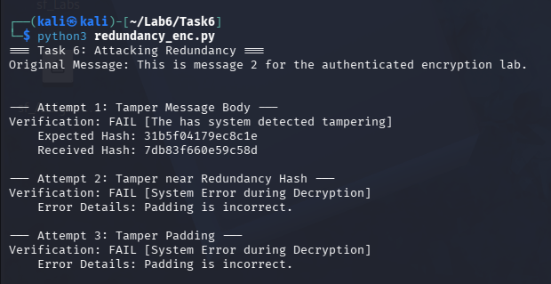

*What to observe:* Some tampering attempts may pass (not detected) because the corruption lands
in the message body rather than the redundancy suffix. This shows the scheme cannot reliably
detect all tampering.

### Explanation

The redundancy check only inspects the last few bytes of the decrypted output. This means that an attacker who modifies bytes in the early ciphertext blocks corrupts only the message body, and this means that the redundancy suffix survives intact and the check passes. Because the check is deterministic and its location is known, it provides no guarantee on the basis of security. A proper MAC uses a secret key and covers the entire message, making selective forgery computationally illogical and quite infeasible.

---

## Task 7 — Encrypt-and-MAC

### Overview

Encrypt-and-MAC computes the MAC over the **plaintext** and the encryption independently,
then sends both. This is the weakest authenticated-encryption construction.

### Source Code

```python
"""
Task 7 – Encrypt-and-MAC
"""

import hmac
import hashlib
import os
from task2_aes_cbc import aes_cbc_encrypt, aes_cbc_decrypt, PLAINTEXT_FILE


def encrypt_and_mac(enc_key, mac_key, iv, plaintext):
    ciphertext = aes_cbc_encrypt(enc_key, iv, plaintext)
    tag = hmac.new(mac_key, plaintext, hashlib.sha256).digest()
    return ciphertext, tag


def verify_and_decrypt(enc_key, mac_key, iv, ciphertext, tag):
    decrypted = aes_cbc_decrypt(enc_key, iv, ciphertext)
    expected  = hmac.new(mac_key, decrypted, hashlib.sha256).digest()
    if hmac.compare_digest(tag, expected):
        return decrypted
    return None


def main():
    enc_key = os.urandom(32)
    mac_key = os.urandom(32)
    iv      = os.urandom(16)

    with open(PLAINTEXT_FILE, "rb") as f:
        plaintext = f.read()

    ciphertext, tag = encrypt_and_mac(enc_key, mac_key, iv, plaintext)
    recovered       = verify_and_decrypt(enc_key, mac_key, iv, ciphertext, tag)

    print("=== Task 7: Encrypt-and-MAC ===\n")
    print(f"Ciphertext : {ciphertext.hex()}")
    print(f"MAC tag    : {tag.hex()}")
    print(f"Verified   : {'YES' if recovered is not None else 'NO'}")
    print(f"Recovered  : {recovered!r}")


if __name__ == "__main__":
    main()
```

### Steps

**Step 1 — Run the encrypt-and-MAC script**

```bash
python code/task7_encrypt_and_mac.py
```

### Screenshots

**Screenshot 1 — `task7_encrypt_and_mac.py` terminal output**

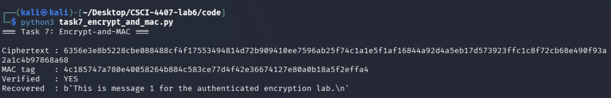

### Explanation

In Encrypt-and-MAC the tag authenticates the **plaintext**, not the ciphertext. This has two
weaknesses: (1) the tag may leak information about the plaintext since it is computed from it
directly, and (2) an attacker can modify the ciphertext without invalidating the tag, because
the tag is tied to the original plaintext. When the receiver decrypts the tampered ciphertext
and recomputes the MAC from the resulting garbage, it will not match — but the decryption has
already occurred, potentially exposing the receiver to chosen-ciphertext attacks.

---

## Task 8 — MAC-then-Encrypt

### Overview

MAC-then-Encrypt computes the MAC over the plaintext, appends it, then encrypts everything
together. Both valid and tampered cases are demonstrated.

### Source Code

```python
"""
Task 8 – MAC-then-Encrypt
"""

import hmac
import hashlib
import os
from task2_aes_cbc import aes_cbc_encrypt, aes_cbc_decrypt, PLAINTEXT_FILE

MAC_SIZE = 32


def mac_then_encrypt(enc_key, mac_key, iv, plaintext):
    tag        = hmac.new(mac_key, plaintext, hashlib.sha256).digest()
    ciphertext = aes_cbc_encrypt(enc_key, iv, plaintext + tag)
    return ciphertext


def decrypt_then_verify(enc_key, mac_key, iv, ciphertext):
    decrypted = aes_cbc_decrypt(enc_key, iv, ciphertext)
    plaintext, received_tag = decrypted[:-MAC_SIZE], decrypted[-MAC_SIZE:]
    expected_tag = hmac.new(mac_key, plaintext, hashlib.sha256).digest()
    if hmac.compare_digest(received_tag, expected_tag):
        return plaintext
    return None


def tamper(ciphertext, index=0):
    ct = bytearray(ciphertext)
    ct[index] ^= 0xFF
    return bytes(ct)


def main():
    enc_key = os.urandom(32)
    mac_key = os.urandom(32)
    iv      = os.urandom(16)

    with open(PLAINTEXT_FILE, "rb") as f:
        plaintext = f.read()

    ciphertext = mac_then_encrypt(enc_key, mac_key, iv, plaintext)

    recovered = decrypt_then_verify(enc_key, mac_key, iv, ciphertext)
    print("=== Task 8: MAC-then-Encrypt ===\n")
    print(f"Valid case    → {'PASS' if recovered is not None else 'FAIL'}: {recovered!r}")

    tampered_ct        = tamper(ciphertext)
    recovered_tampered = decrypt_then_verify(enc_key, mac_key, iv, tampered_ct)
    print(f"Tampered case → {'PASS (not detected!)' if recovered_tampered is not None else 'FAIL (detected)'}")


if __name__ == "__main__":
    main()
```

### Steps

**Step 1 — Run the MAC-then-Encrypt script**

```bash
python code/task8_mac_then_encrypt.py
```

### Screenshots

**Screenshot 1 — `task8_mac_then_encrypt.py` terminal output**

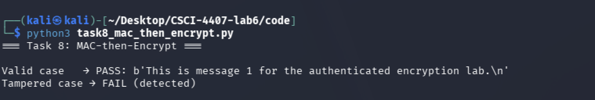

### Explanation

MAC-then-Encrypt hides the MAC inside the ciphertext, which is an improvement over
Encrypt-and-MAC. However, the receiver must **decrypt first** before verifying the MAC. This
means the decryption oracle is exposed to unverified ciphertext, making the scheme vulnerable
to padding-oracle attacks (e.g., BEAST, Lucky13 against TLS). The order of operations matters:
verification should happen on the ciphertext *before* any decryption work is done.

---

## Task 9 — Encrypt-then-MAC (CRITICAL)

### Overview

The correct construction: encrypt first, then compute the MAC over the ciphertext (and IV).
The tag is **verified before any decryption** occurs. Three cases are tested: valid, tampered
ciphertext, and tampered tag.

### Source Code

```python
"""
Task 9 – Encrypt-then-MAC (CRITICAL)
"""

import hmac
import hashlib
import os
from task2_aes_cbc import aes_cbc_encrypt, aes_cbc_decrypt, PLAINTEXT_FILE


def encrypt_then_mac(enc_key, mac_key, iv, plaintext):
    ciphertext = aes_cbc_encrypt(enc_key, iv, plaintext)
    tag        = hmac.new(mac_key, iv + ciphertext, hashlib.sha256).digest()
    return ciphertext, tag


def verify_then_decrypt(enc_key, mac_key, iv, ciphertext, tag):
    expected = hmac.new(mac_key, iv + ciphertext, hashlib.sha256).digest()
    if not hmac.compare_digest(tag, expected):
        return None
    return aes_cbc_decrypt(enc_key, iv, ciphertext)


def tamper_ciphertext(ciphertext, index=0):
    ct = bytearray(ciphertext)
    ct[index] ^= 0xFF
    return bytes(ct)


def tamper_tag(tag, index=0):
    t = bytearray(tag)
    t[index] ^= 0xFF
    return bytes(t)


def main():
    enc_key = os.urandom(32)
    mac_key = os.urandom(32)
    iv      = os.urandom(16)

    with open(PLAINTEXT_FILE, "rb") as f:
        plaintext = f.read()

    ciphertext, tag = encrypt_then_mac(enc_key, mac_key, iv, plaintext)

    print("=== Task 9: Encrypt-then-MAC ===\n")

    result = verify_then_decrypt(enc_key, mac_key, iv, ciphertext, tag)
    print(f"Valid case            → {'PASS' if result is not None else 'FAIL'}: {result!r}")

    result_ct = verify_then_decrypt(enc_key, mac_key, iv, tamper_ciphertext(ciphertext), tag)
    print(f"Ciphertext tampered   → {'PASS (not detected!)' if result_ct is not None else 'FAIL (rejected)'}")

    result_tag = verify_then_decrypt(enc_key, mac_key, iv, ciphertext, tamper_tag(tag))
    print(f"Tag tampered          → {'PASS (not detected!)' if result_tag is not None else 'FAIL (rejected)'}")


if __name__ == "__main__":
    main()
```

### Steps

**Step 1 — Run the Encrypt-then-MAC script**

```bash
python code/task9_encrypt_then_mac.py
```

### Screenshots

**Screenshot 1 — `task9_encrypt_then_mac.py` terminal output**

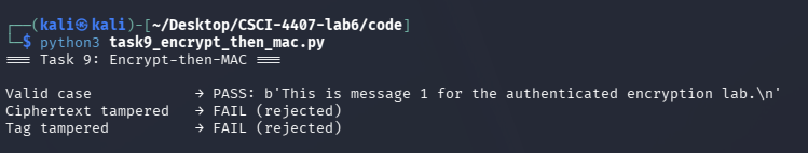


### Explanation

Encrypt-then-MAC achieves **INT-CTXT** (integrity of ciphertexts) because the MAC is computed
over the ciphertext itself. Any modification to the ciphertext or IV invalidates the tag, and
the tag is verified *before* the decryption function is called. This eliminates the padding
oracle surface entirely. It is the construction recommended by cryptographers (Bellare &
Namprempre, 2000) and used in modern protocols like TLS 1.3 and the NaCl/libsodium library.

---

## Task 10 — Comparison Table

### Overview

A summary of all five constructions evaluated in this lab, comparing their privacy and
integrity properties.

### Source Code

```python
"""
Task 10 – Comparison Table
"""

def main():
    header = f"{'Method':<22} {'Privacy':<10} {'Integrity':<12} {'Secure?':<8}"
    sep    = "-" * len(header)

    rows = [
        ("AES-CBC only",       "Yes", "No",       "No"),
        ("Redundancy",         "Yes", "Weak",     "No"),
        ("Encrypt-and-MAC",    "Yes", "Partial",  "No"),
        ("MAC-then-Encrypt",   "Yes", "Partial",  "No"),
        ("Encrypt-then-MAC",   "Yes", "Yes",      "Yes"),
    ]

    print("=== Task 10: Comparison Table ===\n")
    print(header)
    print(sep)
    for method, privacy, integrity, secure in rows:
        print(f"{method:<22} {privacy:<10} {integrity:<12} {secure:<8}")

if __name__ == "__main__":
    main()
```

### Steps

**Step 1 — Run the comparison script**

```bash
python code/task10_comparison.py
```

### Screenshots

**Screenshot 1 — `task10_comparison.py` terminal output**

<!-- Insert screenshot: terminal showing the formatted comparison table -->

### Results Table

| Method             | Privacy | Integrity | Secure? | Notes                                      |
|--------------------|---------|-----------|---------|--------------------------------------------|
| AES-CBC only       | Yes     | No        | No      | No authentication; tampering undetectable  |
| Redundancy         | Yes     | Weak      | No      | Fixed sentinel easily bypassed             |
| Encrypt-and-MAC    | Yes     | Partial   | No      | MAC over plaintext; leaks info             |
| MAC-then-Encrypt   | Yes     | Partial   | No      | Must decrypt before verifying; oracle risk |
| Encrypt-then-MAC   | Yes     | Yes       | **Yes** | Verifies before decrypt; INT-CTXT secure   |

---

## Task 11 — Reflection

### Overview

Conceptual questions about authenticated encryption, INT-CTXT, and the importance of
construction order.

### Source Code

```python
"""
Task 11 – Reflection
"""

QUESTIONS = {
    "Q1": "Why is confidentiality alone insufficient?",
    "Q2": "What does INT-CTXT mean?",
    "Q3": "Why does integrity matter for secure communication?",
    "Q4": "Why does the order of encryption and MAC matter?",
    "Q5": "What is the key takeaway from Encrypt-then-MAC?",
}

ANSWERS = {
    "Q1": "TODO – fill in your answer",
    "Q2": "TODO – fill in your answer",
    "Q3": "TODO – fill in your answer",
    "Q4": "TODO – fill in your answer",
    "Q5": "TODO – fill in your answer",
}

def main():
    print("=== Task 11: Reflection ===\n")
    for key, question in QUESTIONS.items():
        print(f"{key}: {question}")
        print(f"     {ANSWERS[key]}\n")

if __name__ == "__main__":
    main()
```

### Reflection Answers

**Q1: Why is confidentiality alone insufficient?**

<!-- TODO: answer here -->

**Q2: What does INT-CTXT mean?**

<!-- TODO: answer here -->

**Q3: Why does integrity matter for secure communication?**

<!-- TODO: answer here -->

**Q4: Why does the order of encryption and MAC matter?**

<!-- TODO: answer here -->

**Q5: What is the key takeaway from Encrypt-then-MAC?**

<!-- TODO: answer here -->

---

## References

- Bellare, M. & Namprempre, C. (2000). *Authenticated Encryption: Relations among notions and analysis of the generic composition paradigm.* ASIACRYPT 2000.
- NIST FIPS 197 — Advanced Encryption Standard (AES)
- Python `cryptography` library documentation: https://cryptography.io
